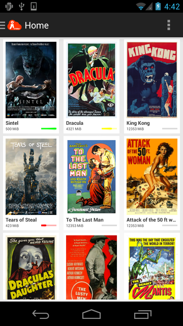
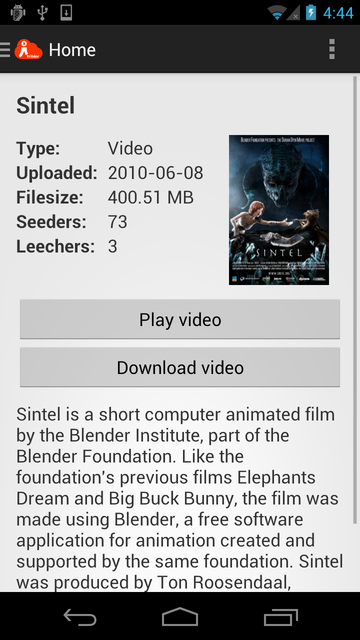
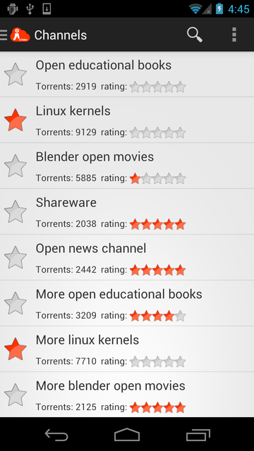

# Tribler Streaming for Android Project

An ongoing port effort to run [Tribler](https://github.com/tribler/tribler/) on Android using [Python for Android](https://github.com/kivy/python-for-android/) and an Android GUI.

## Dependencies

This project has the following dependencies:
* [Tribler](https://github.com/tribler/tribler/) (LGPL v2.1)
* [libswift](https://github.com/libswift/libswift) (LGPL v2.1)
* [Python for Android](https://github.com/kivy/python-for-android) (MIT/LGPL v2.1)
* [Picasso](https://github.com/square/picasso) (Apache v2)
* [VLC for Android](http://www.videolan.org/vlc/download-android.html) (GPL v2)

## Screenshots

Below, some screenshots of the current GUI are shown.

	

*Home screen showing list of media files.*

*List of channels containing torrents.*

*Info about a torrent with the option to play it using the built-in VLC player.*
